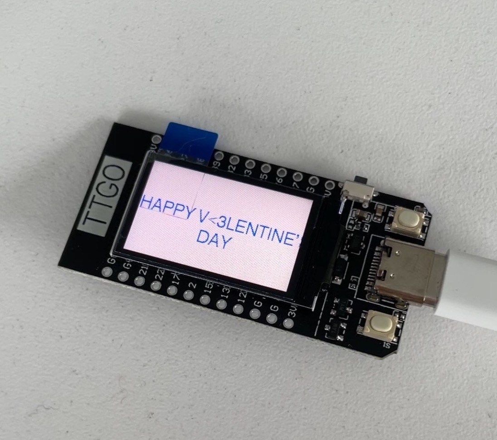
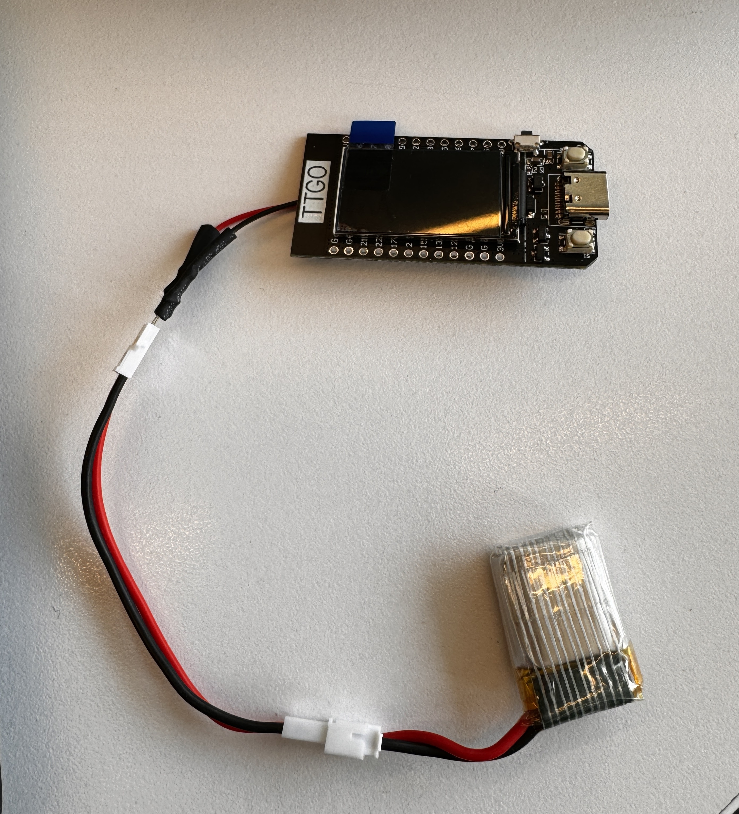
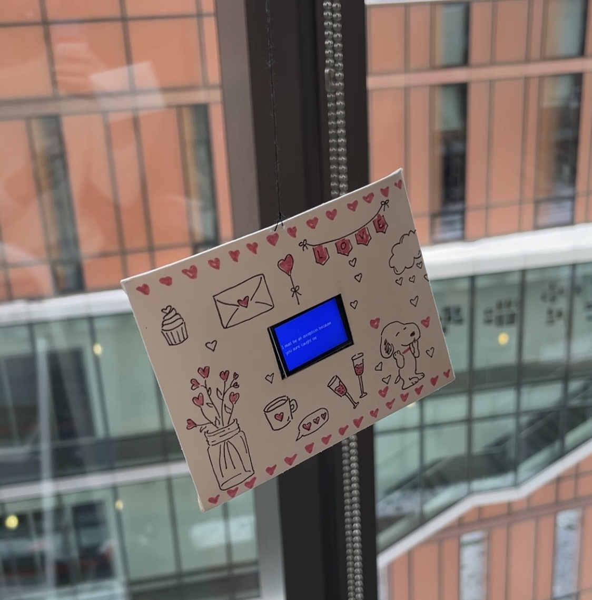

# Module 1: CodeCupid

## Project Overview
This project was created for the module 1 assignment in COMS3930 Creative 
Embedded Systems. Since the installation of this project took place the week of
Valentine's Day, I choose to display computer science pick up lines on an 
ESP32.

## Software Installation and Setup
For this project, I used Arduino IDE 2.2.1 and an ESP32. I used a USB-C to
connect the ESP32 to my computer.
### Arduino Setup
1. Download Arduino (https://www.arduino.cc/en/software)
2. To enable the ESP32 board on Arduino, go to Arduino IDE -> 
Settings and then type "https://dl.espressif.com/dl/package_esp32_index.json"
in the "Additional boards manager URLs" field. 
3. Then go to Tools -> Boards -> ESP32 Arduino and select TTGO T1
4. Select the port that connects the ESP32 to your computer. In my case, I
selected the port containing "usbserial"
5. To install the necessary library, go to Tools -> Manage Libraries and 
search for "TFT_eSPI" by Bodmer. Click "Install"
6. Go to Arduino IDE -> Settings and find the filepath for the "Sketchbook 
location" field. Navigate to that path in order to find the Arduino folder
in your filesystem and open libraries/TFT_eSPI/User_Setup_Select.h. Comment out
the line #include <User_Setup.h> and uncomment the line #include <User_Setups/Setup25_TTGO_T_Display.h

### To flash my module-1 code:
1. Open the "module-1.ino" file in this repo and copy the code.
2. Create a new file on Arduino by going to File -> New Sketch
3. Delete any existing code in the new sketch and past my code
4. Hit the Upload button (the circular button in the top left with a "->" icon)
to flash the code to your ESP32

### Installation
1. Cut a square out of the front of an envelope. Make sure the square is as
large as your ESP32 screen.
2. Decorate the envelope as you wish.
3. Cut two small (roughly one centimeter) pieces of shrink wrap and use them to 
cover the exposed metal parts of the red and black battery wires. Use a heat
gun to mold the shrink wrap to the wires.
4. Use the adapter to connect the battery to the ESP32

5. Place the ESP32, adapter, and battery inside the envelope. Make sure that the
cut out of the envelope shows the screen of the ESP32.
6. Cut a 3-4 foot piece of string
6. Drill a hole into a popsicle stick and place the end of the string through 
the hole in the popsicle stick, then tie the string.
7. Create a hole in the envelope and place the other end of the string through
this hole, then tie the string.
8. Attach the popsicle stick to the ceiling so that the envelope holding the 
ESP32 is displayed in the air.
