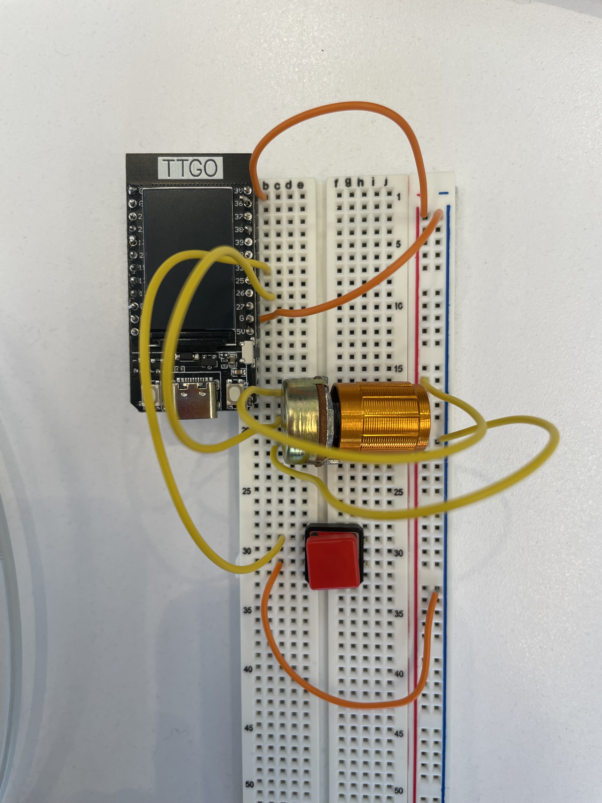
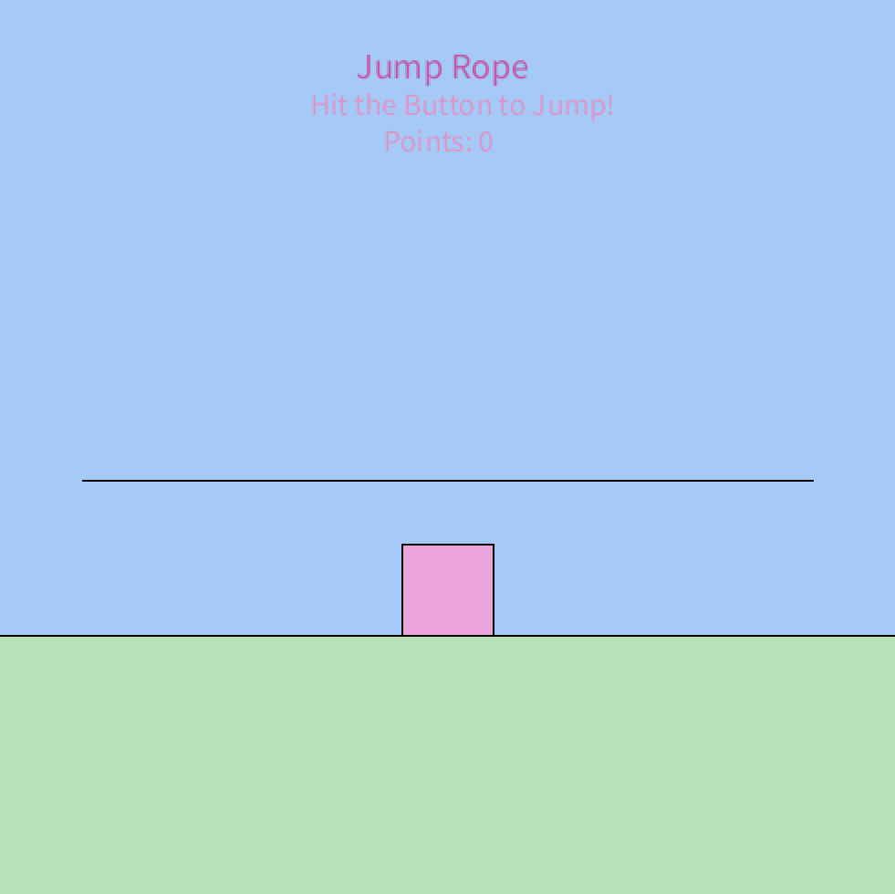
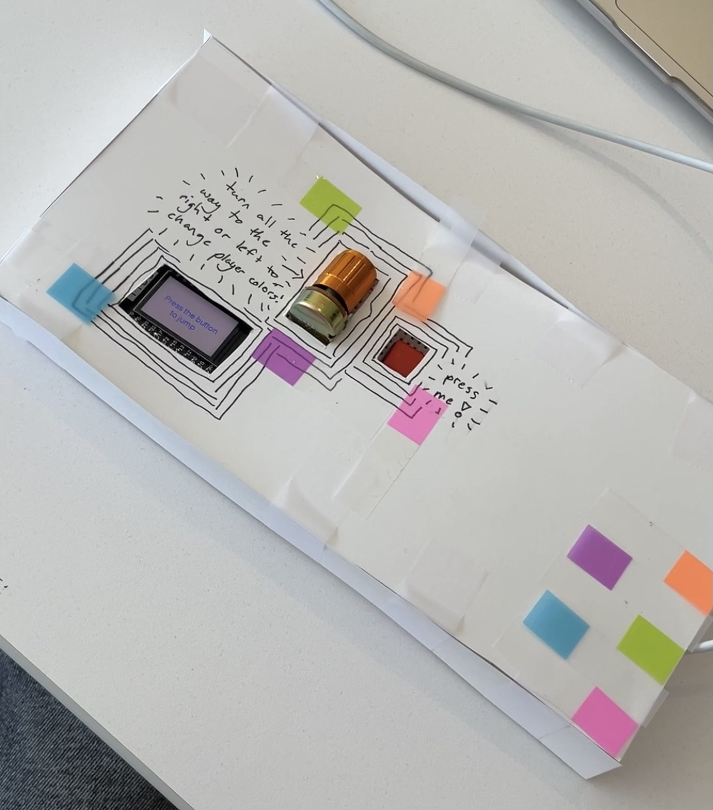

# Module 2: JumpRope

## Project Overview
This project was created for the module 2 assignment in COMS3930 Creative 
Embedded Systems. I created an interactive device using a ESP32 TTGO T-Display,
a button, and a potentiometer that allows you to play a simple jump rope game
that I created with Processing.

## Software Installation and Setup
For this project, I used Arduino IDE 2.2.1 and an ESP32. I used a USB-C to
connect the ESP32 to my computer.
### Arduino Setup
1. Download Arduino (https://www.arduino.cc/en/software)
2. To enable the ESP32 board on Arduino, go to Arduino IDE -> 
Settings and then type "https://dl.espressif.com/dl/package_esp32_index.json"
in the "Additional boards manager URLs" field. 
3. Then go to Tools -> Boards -> ESP32 Arduino and select TTGO T1
4. Select the port that connects the ESP32 to your computer. In my case, I
selected the port containing "usbserial"
5. To install the necessary library, go to Tools -> Manage Libraries and 
search for "TFT_eSPI" by Bodmer. Click "Install"
6. In order to flash code to my ESP32, I needed to also edit my <User_Setup.h>
file. If you are unable to flash code after following the steps above, go to
Arduino IDE -> Settings and find the filepath for the "Sketchbook  location" 
field. Navigate to that path in order to find the Arduino folder in your 
filesystem and open libraries/TFT_eSPI/User_Setup_Select.h. Comment out the
line #include <User_Setup.h> and uncomment the line 
#include <User_Setups/Setup25_TTGO_T_Display.h

### To flash my module-1 code:
1. Open the "module-2.ino" file in this repo and copy the code.
2. Create a new file on Arduino by going to File -> New Sketch
3. Delete any existing code in the new sketch and past my code
4. Hit the Upload button (the circular button in the top left with a "->" icon)
to flash the code to your ESP32

### Connecting the sensors with the ESP32
1. Connect the ESP32 to a breadboard
2. Place the button and the potentiometer on the breadboard
3. Use wires to connect the ESP32 to each sensor. Follow the image below to
connect the wires to the correct pins.
- In this example, I used pin 33 for the button and pin 26 for the potentiometer
- If you would like to use a different pin, make sure to adjust the constant 
variables for the pin values in the Arduino code and flash the code again

### Play Game in Processing
1. Download Processing https://processing.org/download
2. Open Processing, go to File -> New
3. Copy the code from jumpRope.pde into the new file
4. Press the triangle "Play" button
5. To jump in the jump rope game, press the button on the breadboard
6. To change the color of the player, turn the potentiometer all the way to the
left or all the way to the right

### Installation
1. Create a box with a thick paper material that is large enough to enclose the
breadboard, sensors, and ESP32. Use an exacto knife to create holes in the box 
for the button, potentiometer, screen of the ESP32, and the USB-C cord.
2. Decorate the box as you wish
